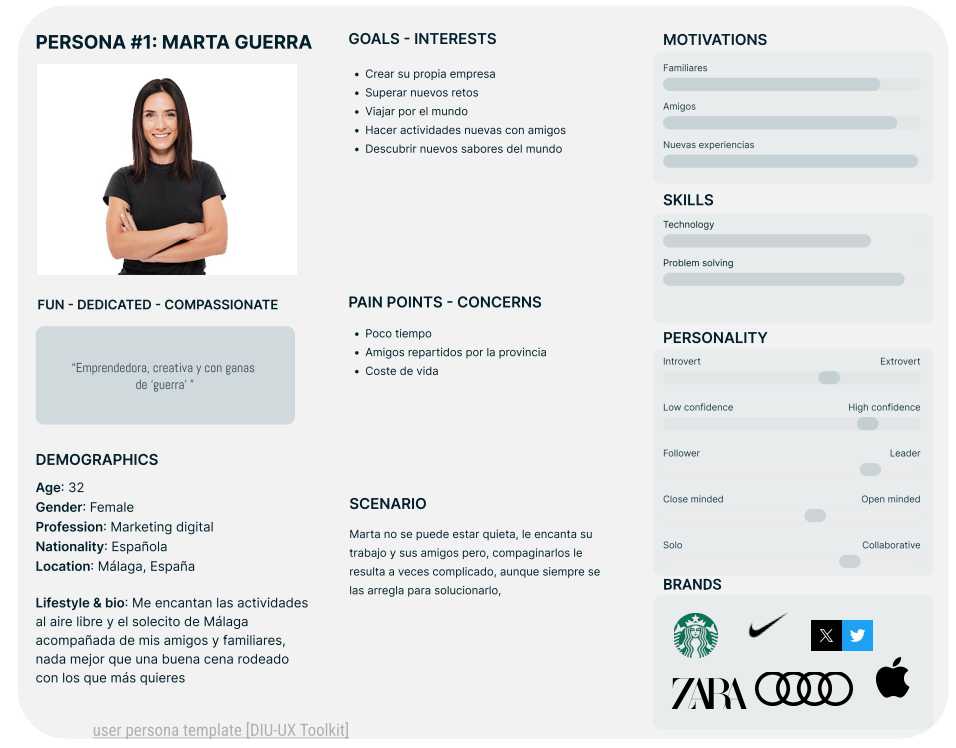
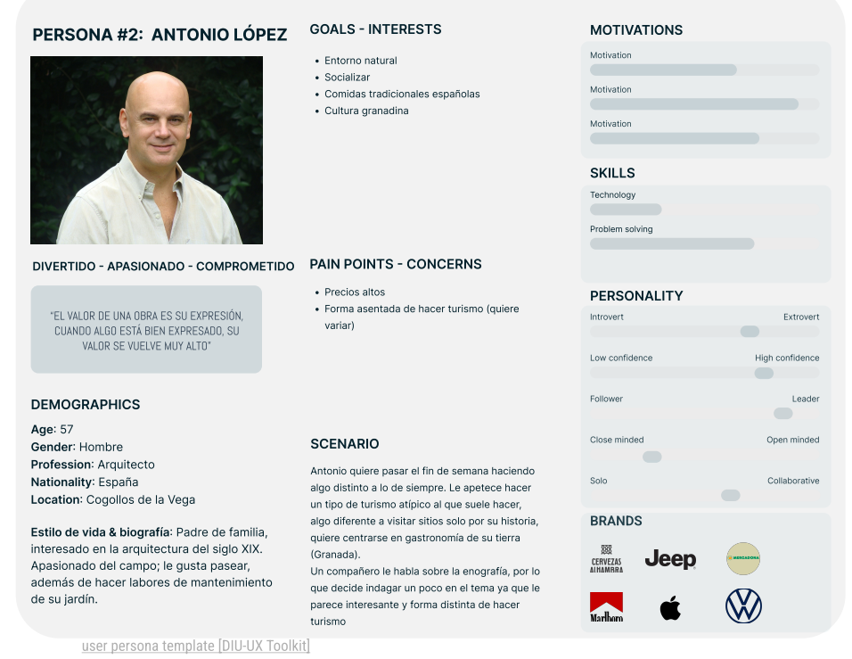
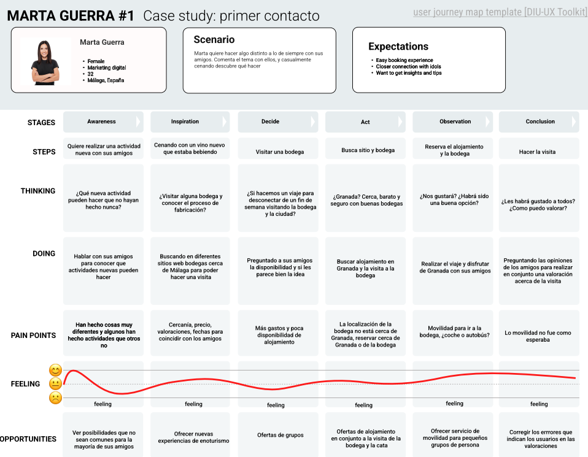
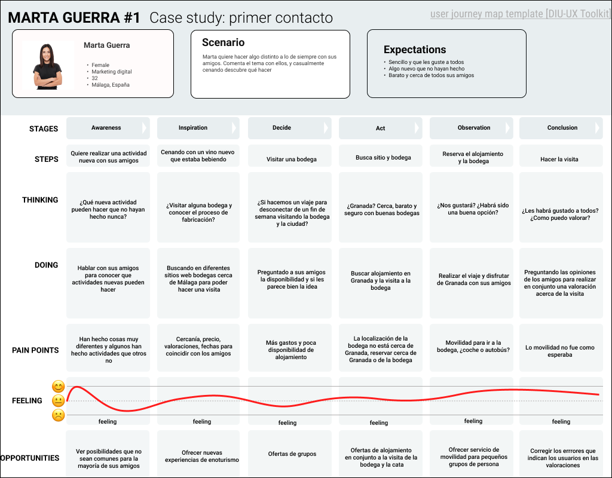
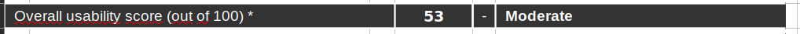

# DIU24
Prácticas Diseño Interfaces de Usuario 2023-24 (Tema: .... ) 

Grupo: DIU3.LasDoBolita.  Curso: 2023/24 
Updated: 11/2/2024

Proyecto: 
>>> Decida el nombre corto de su propuesta en la práctica 2 

Descripción: 

>>> Describa la idea de su producto en la práctica 2 

Logotipo: 
>>> Opcionalmente si diseña un logotipo para su producto en la práctica 3 pongalo aqui

Miembros
 * :bust_in_silhouette:   Jesús Pereira Sánchez     :octocat:     
 * :bust_in_silhouette:  Raúl Florentino Serra     :octocat:

----- 

# Proceso de Diseño 

## Paso 1. UX User & Desk Research & Analisis 

 1.a User Reseach Plan
-----

Se quiere analizar la web https://rutadelosvinosdegranada.com/ a nivel de interfaz de usuario y de funcionalidades, la relación entre los dos. Gracias a esto, podemos especificar los objetivos de la página, además de algunas preguntas que se puedan plantear los usuarios. Tras este análisis podremos mejorar la web en función de los puntos especificados anteriormente, en función de si cuadran o no con los que se pretendían al inicio del desarrollo de la misma.

Gracias al plan de User Research podemos definir las claves sobre esta investigación: ¿Quién analiza? ¿Por qué lo hace? ¿Qué es lo que analiza? ... Nos basamos en una plantilla ya definida para realizar esta investigación. 

 1.b Competitive Analysis
-----

Para el análisis competitivo hemos elegido adicionalmente de la página que estamos analizando otras 2 alternativas:

> https://enoturismospain.com/
> https://turismodevino.com/

En la primera opción, tenemos una página que si bien entra mucho por el ojo (cabe destacar que es la que mejor apariencia presenta de las tres), es la que más pobre en cuanto a contenido ofrece. Solo ofrece visitas a bodegas. Pese a esto, cabe destacar que es la más accesible: Tiene traducción a 5 idiomas. Ofrece actividades en toda la península. Otro aspecto negativo a destacar es que redirige mucho a otras páginas para hacer la reserva, por lo que puede llegar a afectar al usuario a la hora de navegar y perderse entre tantas pestañas.

En contraste, tenemos la segunda alternativa planteada, la que más variedad de contenido ofrece: Catas, actividades, visitas a bodegas, escapadas de pareja, venta de vinos y etc. De las 3 webs, es la que peor apariencia tiene ya que además de tener html un poco raro, tiene algunos bugs visuales, y las fotos de baja calidad dejan un poco que desear. Tiene traducción solo al inglés. 

Por último, la página web https://rutadelosvinosdegranada.com/ es la más equilibrada en cuanto apariencia y variedad de contenido. No es la mejor en esos ámbitos, pero no es la peor. Es la que más variedad de contenido ofrece en Granada (las otras son más nacionales, pero no se centran tanto en zonas en específicas). La carga de contenidos es un poco lenta, puede ser un poco frustante y afectar la experiencia al usuario. No tiene traducción a otros idiomas, por lo que usuarios que no sepan español pueden no verse atraidos a la página si no se valen de recursos de traducción de página. 

Hemos elegido https://turismodevino.com/ como la mejor de las 3. Si bien no es la página que mejor apariencia visual tiene, es la que más contenidos ofrece, por lo que cuanta más variedad se le ofrezca al usuario, este podrá elegir la experiencia que más se acerque a sus preferencias. 

 1.c Persona
-----

Nuestros dos usuarios (Antonio y Marta) son un claro ejemplo de usuarios que pueden llegar a acceder a nuestra página de forma casual sin conocer el Enoturismo. 
Antonio es una persona adulta, la cuál quiere hacer turismo, algo distinto a lo de siempre, y en Granada. Por otro lado, Marta, la cual tiene un objetivo en común con Antonio: hacer turismo diferente a lo acostumbrado con sus amigos.

 
 

 1.d User Journey Map
----

Antonio encuentra la página web investigando un poco sobre el Enoturismo, un tema que le comentó un compañero de trabajo. Marta, al plantearse sobre el proceso de elaboración del vino encuentra la web. 

Son formas casuales de aproximarse tanto al tema (Enoturismo: cata de vinos), como de aproximarse a una web como es la nuestra u otra. Son formas que cualquiera de nosotros podría haber tomado para llegar a la página web, no es muy específico.
 
 
 

 1.e Usability Review
----

Enlace:
[Usability Review PDF](P1/Usability-review-template.pdf)

Puntuación final:

Valoración:

- Valoración de Usabilidad

La usabilidad de la página web no es de las mejores, hay un gran margen de mejora que podría tener varios puntos importantes como el rendimiento a la hora de cargar de disintias páginas, la navegación no es del todo intuitiva y hay mucha información redundante, a la hora de la búsqueda se podría tener en cuenta añadir filtros de búsqueda para hacerla más eficiente más eficaz.

- Aspectos Negativos

**Navegación poco intuitiva:** La estructura de la página web es enigmática cuando accedes a una parte del menú te pierdes y no sabes volver atrás no hay ningún menú para saber donde te encuentras y como has llegado
  
**Rendimiento:** La página tarda mucho tiempo en cargar al cambiar de una págna a otra lo que lleva al usuario a estresarse y no querer navegar más por ella

**Problema de mercado:** En la página al utilizar la opción de compra, tiene problemas a la hora de seleccionar los productos que se desean comprar

- Áreas de mejora

**Optimización para Dispositivos Móviles:** Aunque la página es funcional en dispositivos móviles, podría mejorar su adaptabilidad y respuesta en pantallas más pequeñas. Se recomienda realizar pruebas adicionales en diferentes dispositivos móviles para garantizar una experiencia consistente.
  
**Ofertar más productos:** Tiene una amplia

- **Simplificación del Proceso de Registro:** Si hay un proceso de registro en la página, se recomienda simplificarlo y reducir el número de pasos necesarios. Los usuarios tienden a abandonar rápidamente los sitios con procesos de registro complicados.

En resumen, aunque la página web ofrece una experiencia general positiva, existen oportunidades para mejorar su usabilidad y accesibilidad. Al abordar estas áreas de mejora, podemos garantizar que la página sea más efectiva en la satisfacción de las necesidades de los usuarios y en la consecución de los objetivos del sitio.

## Paso 2. UX Design  

 2.a Reframing / IDEACION: Feedback Capture Grid / EMpathy map 
----

>>> Comenta con un diagrama los aspectos más destacados a modo de conclusion de la práctica anterior,

 Interesante | Críticas     
| ------------- | -------
  Preguntas | Nuevas ideas
  
    
>>> ¿Que planteas como "propuesta de valor" para un nuevo diseño de aplicación para economia colaborativa ?
>>> Problema e hipótesis
>>>  Que planteas como "propuesta de valor" para un nuevo diseño de aplicación para economia colaborativa te
>>> (150-200 caracteres)

 2.b ScopeCanvas
----
>>> Propuesta de valor 

 2.b User Flow (task) analysis 
-----

>>> Definir "User Map" y "Task Flow" ... 

 2.c IA: Sitemap + Labelling 
----

>>> Identificar términos para diálogo con usuario  

Término | Significado     
| ------------- | -------
  Login¿?  | acceder a plataforma

 2.d Wireframes
-----

>>> Plantear el  diseño del layout para Web/movil (organización y simulación ) 

## Paso 3. Mi UX-Case Study (diseño)

 3.a Moodboard
-----

>>> Plantear Diseño visual con una guía de estilos visual (moodboard) 
>>> Incluir Logotipo
>>> Si diseña un logotipo, explique la herramienta utilizada y la resolución empleada. ¿Puede usar esta imagen como cabecera de Twitter, por ejemplo, o necesita otra?

  3.b Landing Page
----

>>> Plantear Landing Page 

 3.c Guidelines
----

>>> Estudio de Guidelines y Patrones IU a usar 
>>> Tras documentarse, muestre las deciones tomadas sobre Patrones IU a usar para la fase siguiente de prototipado. 

  3.d Mockup
----

>>> Layout: Mockup / prototipo HTML  (que permita simular tareas con estilo de IU seleccionado)

 3.e ¿My UX-Case Study?
-----

>>> Publicar my Case Study en Github..
>>> Documente y resuma el diseño de su producto

## Paso 5. Exportación & evaluación con Eye Tracking 

Exportación a HTML/Flutter
-----

)  5.b Eye Tracking method 

>>> Indica cómo diseñas experimento y reclutas usuarios (uso de gazerecorder.com)  

Diseño del experimento 
----

>> Uso de imágenes (preferentemente) -> hay que esablecer una duración de visualización y  
>> fijar las áreas de interes (AoI) antes del diseño. Planificar qué tarea debe hacer el usuario (buscar, comprar...) 

  
>> cambiar img por tu diseño de experimento  

>> Recordar que gazerecorder es una versión de pruebas: usar sólo con 3 usuarios para generar mapa de calor (recordar que crédito > 0 para que funcione) 

Resultados y valoración 
-----

>> Cambiar por tus resultados
  

## Paso 4. Evaluación 

 4.a Caso asignado
----

>>> Breve descripción del caso asignado con enlace a  su repositorio Github

 4.b User Testing
----

>>> Seleccione 4 personas ficticias. Exprese las ideas de posibles situaciones conflictivas de esa persona en las propuestas evaluadas. Asigne dos a Caso A y 2 al caso B
 

| Usuarios | Sexo/Edad     | Ocupación   |  Exp.TIC    | Personalidad | Plataforma | TestA/B
| ------------- | -------- | ----------- | ----------- | -----------  | ---------- | ----
| User1's name  | H / 18   | Estudiante  | Media       | Introvertido | Web.       | A 
| User2's name  | H / 18   | Estudiante  | Media       | Timido       | Web        | A 
| User3's name  | M / 35   | Abogado     | Baja        | Emocional    | móvil      | B 
| User4's name  | H / 18   | Estudiante  | Media       | Racional     | Web        | B 

 4.c Cuestionario SUS
----

>>> Usaremos el **Cuestionario SUS** para valorar la satisfacción de cada usuario con el diseño (A/B) realizado. Para ello usamos la [hoja de cálculo](https://github.com/mgea/DIU19/blob/master/Cuestionario%20SUS%20DIU.xlsx) para calcular resultados sigiendo las pautas para usar la escala SUS e interpretar los resultados
http://usabilitygeek.com/how-to-use-the-system-usability-scale-sus-to-evaluate-the-usability-of-your-website/)
Para más información, consultar aquí sobre la [metodología SUS](https://cui.unige.ch/isi/icle-wiki/_media/ipm:test-suschapt.pdf)

>>> Adjuntar captura de imagen con los resultados + Valoración personal 

 4.d Usability Report
----

>> Añadir report de usabilidad para práctica B (la de los compañeros)

>>> Valoración personal 

5.) Conclusion de EVALUACION (A/B testing + usability report + eye tracking) 
----

>> recupera el usability report de tu práctica (que es el caso B de los asignados a otros grupos) 
>> con los resultados del A/B testing, de eye tracking y del usability report:
>>  comentad en 2-3 parrafos cual es la conclusion acerca de la realización de la práctica y su evaluación con esas técnicas y que habéis aprendido

## Conclusión final / Valoración de las prácticas

>>> (90-150 palabras) Opinión FINAL del proceso de desarrollo de diseño siguiendo metodología UX y valoración (positiva /negativa) de los resultados obtenidos  

