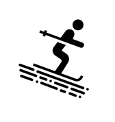
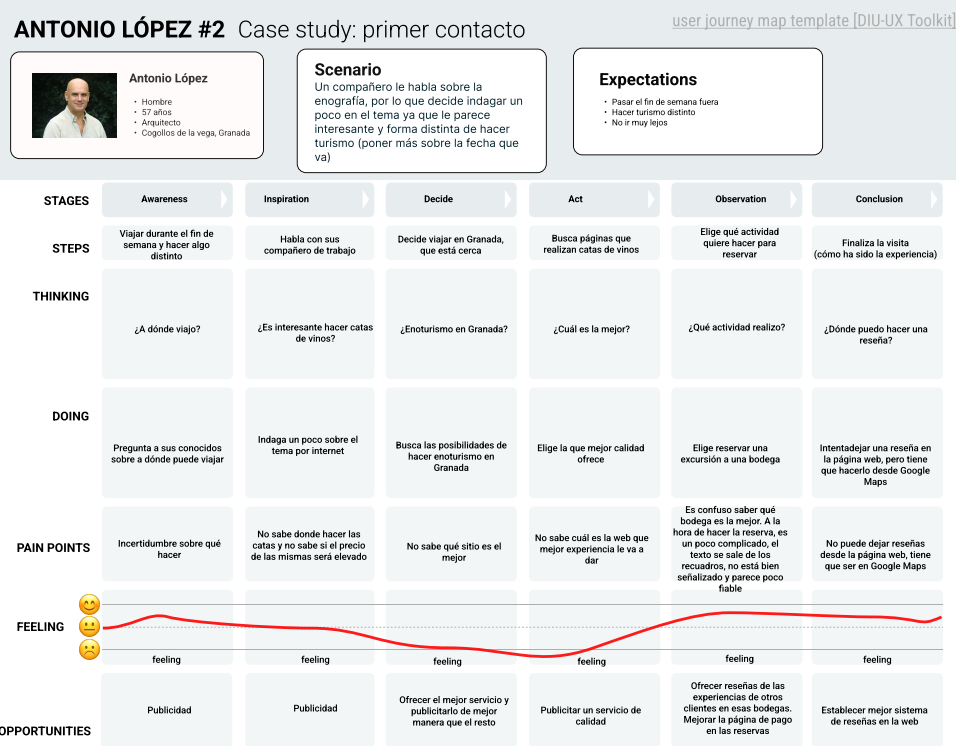
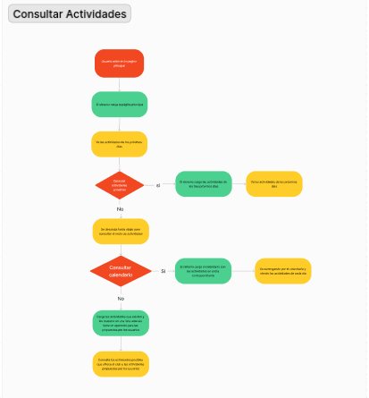

# DIU24
Prácticas Diseño Interfaces de Usuario 2023-24 (Tema: Actividades de montaña y nieve ) 

Grupo: DIU3.LasDoBolita.  Curso: 2023/24 
Updated: 11/2/2024

Proyecto: 
*Amigos de la Nieve*

Descripción: 

Página para organizar y participar en actividades de montaña relacionadas con la nieve, como ski, snowboard, senderismo en la nieve...

Las actividades podrán realizarse en grupo para fomentar el deporte, hacerlas con grupos de amigos y así hacerlas más amenas, además los usuarios tendrán su nivel asociado las actividades que hagan para evitar tener problemas a la hora de hacer deporte con gente más o menos experta.

Logotipo: 

Miembros
 * :bust_in_silhouette:   Jesús Pereira Sánchez     :octocat:     
 * :bust_in_silhouette:  Raúl Florentino Serra     :octocat:

----- 

# Proceso de Diseño 

## Paso 1. UX User & Desk Research & Analisis 

 1.a User Reseach Plan
-----

Se quiere analizar la web https://rutadelosvinosdegranada.com/ a nivel de interfaz de usuario y de funcionalidades, la relación entre los dos. Gracias a esto, podemos especificar los objetivos de la página, además de algunas preguntas que se puedan plantear los usuarios. Tras este análisis podremos mejorar la web en función de los puntos especificados anteriormente, en función de si cuadran o no con los que se pretendían al inicio del desarrollo de la misma.

Gracias al plan de User Research podemos definir las claves sobre esta investigación: ¿Quién analiza? ¿Por qué lo hace? ¿Qué es lo que analiza? ... Nos basamos en una plantilla ya definida para realizar esta investigación. 

 1.b Competitive Analysis
-----

Para el análisis competitivo hemos elegido adicionalmente de la página que estamos analizando otras 2 alternativas:

> https://enoturismospain.com/
> https://turismodevino.com/

En la primera opción, tenemos una página que si bien entra mucho por el ojo (cabe destacar que es la que mejor apariencia presenta de las tres), es la que más pobre en cuanto a contenido ofrece. Solo ofrece visitas a bodegas. Pese a esto, cabe destacar que es la más accesible: Tiene traducción a 5 idiomas. Ofrece actividades en toda la península. Otro aspecto negativo a destacar es que redirige mucho a otras páginas para hacer la reserva, por lo que puede llegar a afectar al usuario a la hora de navegar y perderse entre tantas pestañas.

En contraste, tenemos la segunda alternativa planteada, la que más variedad de contenido ofrece: Catas, actividades, visitas a bodegas, escapadas de pareja, venta de vinos y etc. De las 3 webs, es la que peor apariencia tiene ya que además de tener html un poco raro, tiene algunos bugs visuales, y las fotos de baja calidad dejan un poco que desear. Tiene traducción solo al inglés. 

Por último, la página web https://rutadelosvinosdegranada.com/ es la más equilibrada en cuanto apariencia y variedad de contenido. No es la mejor en esos ámbitos, pero no es la peor. Es la que más variedad de contenido ofrece en Granada (las otras son más nacionales, pero no se centran tanto en zonas en específicas). La carga de contenidos es un poco lenta, puede ser un poco frustante y afectar la experiencia al usuario. No tiene traducción a otros idiomas, por lo que usuarios que no sepan español pueden no verse atraidos a la página si no se valen de recursos de traducción de página. 

Hemos elegido https://turismodevino.com/ como la mejor de las 3. Si bien no es la página que mejor apariencia visual tiene, es la que más contenidos ofrece, por lo que cuanta más variedad se le ofrezca al usuario, este podrá elegir la experiencia que más se acerque a sus preferencias. 

 1.c Persona
-----

Nuestros dos usuarios (Antonio y Marta) son un claro ejemplo de usuarios que pueden llegar a acceder a nuestra página de forma casual sin conocer el Enoturismo. 
Antonio es una persona adulta, la cuál quiere hacer turismo, algo distinto a lo de siempre, y en Granada. Por otro lado, Marta, la cual tiene un objetivo en común con Antonio: hacer turismo diferente a lo acostumbrado con sus amigos.

 
 

 1.d User Journey Map
----

Antonio encuentra la página web investigando un poco sobre el Enoturismo, un tema que le comentó un compañero de trabajo. Marta, al plantearse sobre el proceso de elaboración del vino encuentra la web. 

Son formas casuales de aproximarse tanto al tema (Enoturismo: cata de vinos), como de aproximarse a una web como es la nuestra u otra. Son formas que cualquiera de nosotros podría haber tomado para llegar a la página web, no es muy específico.
 
 
 

 1.e Usability Review
----

Enlace:
[Usability Review PDF](P1/Usability-review-template.pdf)

Puntuación final:

Valoración:

- Valoración de Usabilidad

La usabilidad de la página web no es de las mejores, hay un gran margen de mejora que podría tener varios puntos importantes como el rendimiento a la hora de cargar de disintias páginas, la navegación no es del todo intuitiva y hay mucha información redundante, a la hora de la búsqueda se podría tener en cuenta añadir filtros de búsqueda para hacerla más eficiente más eficaz.

- Aspectos Negativos

**Navegación poco intuitiva:** La estructura de la página web es enigmática cuando accedes a una parte del menú te pierdes y no sabes volver atrás, no hay ningún menú para saber donde te encuentras y como has llegado
  
**Rendimiento:** La página tarda mucho tiempo en cargar al cambiar de una págna a otra lo que lleva al usuario a estresarse y no querer navegar más por ella

**Problema de mercado:** En la página al utilizar la opción de compra, tiene problemas a la hora de seleccionar los productos que se desean comprar

- Áreas de mejora

**Optimización para Dispositivos Móviles:** Aunque la página es funcional en dispositivos móviles, podría mejorar su respuesta en pantalla. Al acceder a algunos páginas no muestra la información correctamente o no se ve tanta información como en ordenador
  
**Mejorar la página:** Ofrecer una visión de cara al público una mejor web, más intuitiva, clara y sencilla en vez de sobrecargarla con información que no sirve

**Reservas:** Hacer las reservas más fáciles ya que un proceso sencillo de reservas permite al usuario reservar con más facilidad y no tener que rellenar un formulario muy complicado

En resumen, aunque la página web ofrece una experiencia general un tanto negativa, existen oportunidades para mejorar su usabilidad. Al abordar estas áreas de mejora, podemos garantizar que la página sea más efectiva en la satisfacción de las necesidades de los usuarios y en la consecución de los objetivos del sitio.

## Paso 2. UX Design  

 2.a Reframing / IDEACION: Feedback Capture Grid / EMpathy map 
----

En el mapa de empatía se pueden ver los pensamientos y acciones que tiene neustro usuario por lo que podría venir a nuestro club

 2.b ScopeCanvas
----

Los usuarios podrán consultar en un amplio catálogo de actividades de nieve filtrando por algunos filtros como ski, snow, senderismo en la nieve, por zonas y demás.

Dentro de cualquier actividad, se muestra información relacionada con ella, como zona en la que se realizará, fechas, material necesario, número de personas mínimas y máximas para realizar actividad, grupos disponibles (con gente que se ha inscrito ya) y disponibilidad de hacer grupos privados y precios. Para este último, se incluyen opciones como alquiler de material (puede que el usuario interesado tenga material y no le interese alquilarlo), transporte a la zona (si el usuario necesita desplazarse allí o no), contratar monitores (si el grupo es primerizo en esa actividad).

Para que el usuario se pueda inscribirse en una actividad será necesario que esté registrado en la página web, aportando datos personales como nombre completo, correo, número de teléfono y demás datos. Una vez registrado en la página, solo necesitará pagar una pequeña cantidad del total por cada miembro que quiera inscribir en la actividad para evitar cancelaciones el día de antes. 

Se podrá cancelar la actividad y devolver importe total si se hace con mucha antelación y siempre y cuando los servicios contratados como materiales, desplazamientos y monitores se puedan cancelar también con ese tiempo de antelación.

 2.b User Flow (task) analysis 
-----

 2.c IA: Sitemap + Labelling 
----

 2.d Wireframes
-----

## Paso 3. Mi UX-Case Study (diseño)

 3.a Moodboard
-----

Para la generación del logotipo, hemos usado la página https://brandmark.io/, una IA que genera un logo en función de un texto y otros requerimientos.

  3.b Landing Page
----

 3.c Guidelines
----

Para nuestra aplicación, hemos usado algunos patrones de diseño como navBar para la búsqueda de actividades, carrusel de fotos de actividades y la hero image, article list y formularios de input para registro e inicio de sesión.

  3.d Mockup
----

 3.e ¿My UX-Case Study?
-----

>>> Publicar my Case Study en Github..
>>> Documente y resuma el diseño de su producto

## Paso 5. Exportación & evaluación con Eye Tracking 

Exportación a HTML/Flutter
-----

  5.b Eye Tracking method 

Para realizr el eye tracking hemos utilizado gazerecorder donde hemos inventado dos usuarios y otros dos han sido compañeros de clase que simulan a una persona, el trabajo que tenian que hacer era ver/apuntarse a una actividad, es la única información que se dió y estos fueron los resultados del eyetracker

### Para la página web A:

  
  
  

### Para la página web B:

  
  
  
  

Resultados y valoración 
-----

Como ya hemos visto los resultados ahora se da paso a la evaluación de ellos para ello utilizamos un A/B testing con un cuetionario SUS para valorar a cada usuario y estos son los resultado

## Paso 4. Evaluación 

 4.a Caso asignado
----
Nosotros tuviamos que evaluar a [Los tomates](https://github.com/Alejandroibo/DIU.LosTomates), en el apartado anterior vemos los resultado que tuvimos y ahora vamos a valorarlos

 4.b User Testing
----

>>> Seleccione 4 personas ficticias. Exprese las ideas de posibles situaciones conflictivas de esa persona en las propuestas evaluadas. Asigne dos a Caso A y 2 al caso B
 

| Usuarios      | Sexo/Edad     | Ocupación   |  Exp.TIC    | Personalidad | Plataforma | TestA/B
| ------------- | -------- | ----------- | ----------- | -----------  | ---------- | ----
| Paula         | M / 23   | Estudiante  | Avanzada    | Sociable, trsite |  Móvil.       | A 
| David  | H / 54   | Fotógrafo  | Baja       | Explorador         | Web        | A 
| Marta  | M / 38   | Administrativa     | Intermedia        | Organizada, dedicada    | Móvil      | B 
| Jose  | H / 22   | Estudiante  | Avanzada       | Alegre     | Web        | B 

 4.c Cuestionario SUS
----

  

Creemos que 

 4.d Usability Report
----

## Usability Report

##### Evaluación de usabilidad del proyecto 

### El trotamundos

### 31 de mayo de 2024

[Los tomates](https://github.com/Alejandroibo/DIU.LosTomates)

### Realizado por:

El informe ha sido realizado por Jesús Pereira Sánchez y Raúl Florentino Serra, hemos realizado distintas acciones y hemos hecho la evaluación del eyetracking con distintos usuarios reales que no tenían relación con los proyectos.

Pero al ser compañeros de clase no se verificar al 100% que sus valoraciones sean justas, honestas y claras ya que al realizar ellos también el proyecto están contaminado.

## 1 DESCRIPCIÓN DEL WEBSITE

El propósito es parecido al de nuestra website, se trata de una app que permite apuntarse a actividades de senderismo que llevará a cabo un monitor y se podrá realizar con más gente,  

## 2 RESUMEN EJECUTIVO

Vemos un poco la usabilidad de la aplicacion así como los usuarios que han sido los encargados de realizar los test. El único fallo que hemos encontrado son los colores que se han utilizado para la aplicación

## 3 METODOLOGIA 

#### Metodología de usabililidad

Hemos utilizado un eyetracker, gazerecorder, para poder ver un mapa de calor de aquellas zonas a las que los usuarios cuando quieren hacer una actividad en la aplicacion dirigen la mirada, en nuestro caso se les dijo que tenian que ver/apuntarse a una actividad, los mapas ya fueron mostrados anteriormente.

#### Test de usuarios: Participantes

Estos son los participantes que han llevado a cabo el test 

| Usuarios      | Sexo/Edad     | Ocupación   |  Exp.TIC    | Personalidad | Plataforma | TestA/B
| ------------- | -------- | ----------- | ----------- | -----------  | ---------- | ----
| Paula         | M / 23   | Estudiante  | Avanzada    | Sociable, trsite |  Móvil.       | A 
| David  | H / 54   | Fotógrafo  | Baja       | Explorador         | Web        | A 
| Marta  | M / 38   | Administrativa     | Intermedia        | Organizada, dedicada    | Móvil      | B 
| Jose  | H / 22   | Estudiante  | Avanzada       | Alegre     | Web        | B 

#### Resultados obtenidos

Los resultados de los test ya fueron vistos anteriormente

## 4 CONCLUSIONES 

Una vez hechas las pruebas y viendo los mapa de calor podemos ver que ambas aplicaciones se ven bastante similares, pues las dos tienen un calendario y distintos botones que permiten ver las actividades en un calendario, registrarse listar las actividades. 

Debido a los colores, la página para el test B nos ha resultado un poco complicada visualmente ya que algunos colores no llegaban a tener un gran contraste y no se apreciaba bien visualmente 

#### Incidencias

No hemos tenido ningún problema a la hora de realizar el test o el cuestionario.

#### Valoración 

Nos ha resultado bastante fácil realizar la valoración ya que las aplicaciones eran similares, algunos de los puntos positivos que tenia la aplicación era lo completas que tenían la información las actividades cuando se mostraban permitiendo al usuario conocer un poco más de la actividad desde fuera y no tener que entrar.

#### Recomendaciones y propuesta de mejoras: 

La apliación en sí es muy completa y bastante intuitiva, lo único que vemos un punto de mejora son los colores. En algunas partes tienen muy poco contraste, otros son bastante oscuros y tienen brillo, colores tan oscuros para una aplicación de senderismo desde nuestro punto de vista es de las pocas cosas mala que tiene, creemos que podrían haber sido colores más claros representado un poco los colores de la montaña cuando tienen sol.

#### Valoración de la prueba de usabilidad (self-assesment)

Es una buena práctica utilizar estás técnicas pues nos proporciona una información muy útil para saber a donde mirará el usuario cuando esté en nuestra aplicación, ayudándonos a detectar errores y como podemos mejorar la experiencia del usuario dentro de nuestra aplicación.

Un ejemplo de ello que no ha sido incluido fue a la hora de realizar una de las pruebas en gazerecoder nos dimos cuenta de que los usuarios cuando entraban en nuestra página lo primero que hacían era ver las imágenes, por ello cambiamos una parte que teníamos y añadimos una imagen cerca para que el usuario se centrara en ella.

## Conclusión final / Valoración de las prácticas

>>> (90-150 palabras) Opinión FINAL del proceso de desarrollo de diseño siguiendo metodología UX y valoración (positiva /negativa) de los resultados obtenidos  

